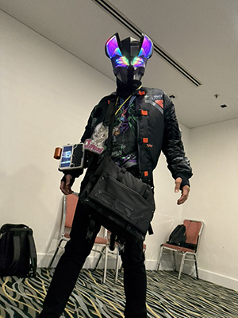
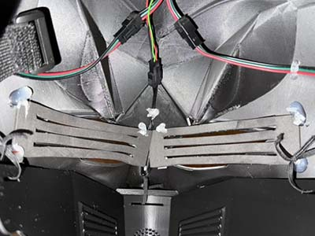
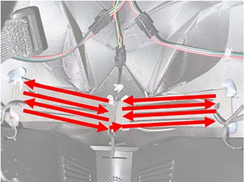
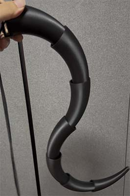
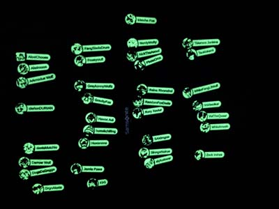

# Furum 2024

These are the assets I used for Furum 2024.

(Thanks to @exogrim23 for the photo!)

## Hardware

- Handheld Computer and Thermal Printer: [DevTerm Kit RPI-CM4 Lite](https://www.clockworkpi.com/product-page/devterm-kit-cm4-series)
- LED Controllers: [Pixelblaze WiFi LED Controller](https://electromage.com/pixelblaze)
- LEDs: [Adafruit Mini Skinny NeoPixel Digital RGB LED Strip](https://www.adafruit.com/product/2969)
- Elastic Bands: [Daiso Elastic Bands](https://shop.daisosingapore.com.sg/collections/scelastic-bands)
- 3D Printer with AMS: [Bambu Lab X1C 3D Printer](https://store.bambulab.com/products/x1-carbon)
- Glow-in-the-dark Filament: [PLA Glow](https://store.bambulab.com/products/pla-glow)

# Head

The head was modelled in [Blender](https://blender.org/) and exported to STL format using the bundled [3D Print Toolbox](https://extensions.blender.org/add-ons/print3d-toolbox/) extension.

## 3D Models

The Blender file is in `head/blend`. I literally picked up just enough 3D modelling to get the job done so the topology is a mess (sorry).

The exported STL files ready for 3D printing are in `head/stl`.

The Jaw and Back pieces are attached to the Top piece using elastic bands routed through cut-out slots.

## LEDs

The lights on the two ears are two separate Neopixel strips with a common data line controlled by a Pixelblaze I named `bmaus`. Besides an example rainbow pattern, the only other custom Pixelblaze pattern is to turn the LEDs off. Both patterns are in `head/pixelblaze/ears/patterns`.

The lights on the eyes are a zigzag pattern of Neopixel strips I soldered together to form two 15x4 panels that I mounted on foam. There are horizontal gaps between the strips so I can see through. These LEDs are controlled by a Pixelblaze I named `cmaus`. Its Pixelblaze 2D pixel map is in `head/pixelblaze/eyes/map.js`. Custom Pixelblaze patterns (including blinking eyes and scrolling 4px text) adapted for this 2D display are in `head/pixelblaze/eyes/patterns`.

I tried putting a gauze/mesh to reduce the glare of bare LEDs for the eyes but the resulting reflections made it impossible for me to see through the gaps. Maybe there is a better solution out there.

# Tail

The tail was modelled in [OpenSCAD](https://openscad.org/) with the [bend.scad](https://github.com/stuartpb/bend.scad) and [BOSL2](https://github.com/BelfrySCAD/BOSL2) libraries installed. The different pieces were then batch rendered using a shell script. Both files are in `tail/src`.

The exported STL files ready for 3D printing are in `tail/stl`.

The pieces are joined together by routing a long piece of elastic through the holes and tying it tight. I tried to implement a rather complex snap-in mechanism but in practice it didn't work well and I relied mostly on the elastic piece's tension to keep the tail taut.

(If you are not on macOS, you will probably need to modify the location of OpenSCAD in the script.)

# App (Animations + Printer +  Remote)

I used a Python Flask web app to run animations on the DevTerm, print custom stickers and serve as a remote for the LEDs. The sticker printing and remote features are also available on mobile without the animations. I didn't actually use it in the end, but the app has the capability to search the web for images to print. The source code is in `app`.

To get started:

1. Download `Spongebob Me Boy.ttf` from [here](https://www.dafont.com/spongeboy-me-bob.font) and save it in the `app` folder. (For some reason, this font's capital letter S does not work when printing stickers. By the time I discovered this, I didn't have time to find a replacement.)

2. Configure a Programmable Search Engine from Google to access their Custom Search JSON API. Try [this link](https://developers.google.com/custom-search/v1/overview). 

3. Copy `.env-example` to `.env` and fill in your Search Engine ID and Custom Search API key.

4. Install `pipenv` (instructions [here](https://pipenv.pypa.io/en/latest/installation.html)), then run `pipenv install` and `pipenv shell` in the `app` folder.

5. Finally, run `python app.py` to start the server. The server should be on the same Wi-Fi network as the Pixelblazes (I used a hotspot). Quitting will require pressing Ctrl-C twice.

Note that absolutely no input validation is performed and it is assumed that all clients are trusted.

I ran the server on the DevTerm and accessed it via `https://localhost:8000`. (Accessing via `localhost` and not via IP address is needed so Chrome can capture the Escape key to cancel operations.) The keyboard controls are:

- `Q` followed by `1` to `6` to switch animations, or `Space` to cycle through them
- `W` followed by `1` to `5` to switch patterns for the ears, or `0` to turn them off
- `E` followed by `1` to `6` to switch patterns for the eyes, or `0` to turn them off
    - Pattern `6` is for scrolling text and will prompt for text to display (up to 12 characters)
- `R` followed by `1` to `5` to switch patterns for ears and eyes together, or `0` to turn them off
- `I` to reinitiate connection to Pixelblazes.
- `P` to print a convention-themed sticker.
- `S` to search the web for a picture and print a furry-themed violation notice (like a parking violation ticket).
- `F` to toggle fullscreen mode.

The default interface is designed for keyboard because the DevTerm's trackball is terible. An alternative touch/mouse interface for mobile/PC can be accessed via `https://raspberrypi.local:8000/mobile` (assuming the DevTerm's hostname is `raspberrypi`).

One area of improvement is to provide the ability to cancel printing (or just to block printing while another print is in progress) so pressing the print button multiple times by accident doesn't cause an uncancellable wasted print.

# Keychain

The keychains are modelled in [OpenSCAD](https://openscad.org/). Two (mostly ChatGPT-written) Python scripts use the [VTracer](https://github.com/visioncortex/vtracer) library to batch convert raster images from the pics folder into SVGs and generate two STL files, one for the "normal" portion of the keychain and one for the glow-in-the-dark portion. Note that the glow-in-the-dark portion has just a blank picture because I rely on Bambu Studio's handling of overlapping regions to fix it. All the source files are in `keychain` and a sample picture is provided in `keychain/pics`.

A useful tip (thanks to @DarrowWolf) is to use a smooth plate and have the name side printed facing down to ensure it comes out flat.

Some pre-requisites:
- All images MUST be 400px by 400px. (I was lazy to parameterise this.)
- As none of the names I printed had reserved characters, the image's filename (without extension) is just the name displayed on the keychain.

To get started:

1. Install `pipenv` (instructions [here](https://pipenv.pypa.io/en/latest/installation.html)), then run `pipenv install` and `pipenv shell` in the `keychain` folder.

2. Run `python convert.py` to batch convert all raster images in the `pics` subfolder to SVGs in the `svgs` subfolder.

3. Run `python generate.py` to batch convert all SVGs in the `svgs` subfolder to STLs in the `stls` subfolder.

(If you are not on macOS, you will probably need to modify the location of OpenSCAD in the script.)

